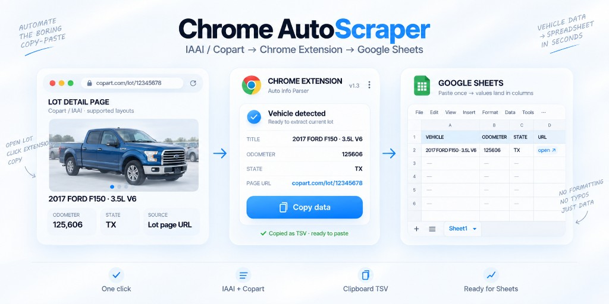

# Auto Info Parser (Chrome Extension)

Parses listing data from **iaai.com** and **copart.com** and copies it to the clipboard in a format suitable for pasting into Google Sheets.



## Purpose

This extension is a **personal productivity helper**. It helps a user who already opened a lot detail page copy a few visible fields (title, odometer, state, URL) into their own spreadsheet — faster than manual typing.

It is **not** an official product of IAAI or Copart, **not** affiliated with them, and **not** intended as a bulk crawler, data reseller, or substitute for any official API or data license.

---

## Disclaimer / Terms of use

**By installing, loading, or using this extension you accept these terms in full.** If you do not agree — uninstall it and do not use it.

### Your obligations (user)

1. **Read the rules first.** Before any use, you must review and follow the Terms of Service, Acceptable Use Policy, robots rules, and other policies of iaai.com, copart.com, and any other site where you run this tool.
2. **Lawful access only.** You confirm that you have a legitimate right to view the page (e.g. your own account / public page access) and that you will not use the extension to bypass paywalls, CAPTCHAs, rate limits, login walls, or other technical restrictions.
3. **Compliance is yours.** You alone decide whether a specific use is allowed. The author does not authorize, encourage, or instruct any use that violates platform rules or law.
4. **Personal use by default.** Prefer copying data for your own notes or spreadsheets. Do not use the extension for bulk harvesting, resale, republication, competing databases, or commercial data products unless you have a separate written license from the platform.
5. **If rules forbid it — stop.** If platform rules prohibit scrapers, automated extraction, or similar tools, **do not use this extension** on that platform.

### No warranty

The software is provided **“AS IS”** and **“AS AVAILABLE”**, without warranties of any kind — express or implied — including merchantability, fitness for a particular purpose, non-infringement, accuracy, or uninterrupted operation. Layouts on third-party sites can change at any time; parsing may break without notice.

### Limitation of liability (developer)

To the maximum extent permitted by law, the author / developer is **not liable** for any direct, indirect, incidental, special, consequential, or punitive damages, including but not limited to:

- account suspension, ban, or loss of platform access;
- claims, demands, or lawsuits by IAAI, Copart, or any third party;
- fines, settlements, legal fees, or business losses;
- data loss, incorrect parsing, or clipboard/spreadsheet errors;
- any other loss arising from install, use, misuse, or inability to use the extension.

**You use the extension at your own risk.** The author does not control third-party websites and is not a party to your relationship with those platforms.

### Indemnification (protects the developer)

You agree to **defend, indemnify, and hold harmless** the author from any claims, damages, losses, and expenses (including reasonable attorneys’ fees) arising out of: (a) your use of the extension; (b) your breach of these terms; (c) your violation of platform rules or law; or (d) any data you extract, store, share, or publish.

### Partial protection for the user

These terms also limit how the tool should be used, which reduces *your* risk if you follow them:

- use only on pages you may lawfully open;
- keep use personal / non-commercial unless licensed;
- do not bypass technical protections;
- do not redistribute scraped listings as a product or public feed.

Following this section does **not** guarantee that a platform will allow the use — it only documents expected safe boundaries. When in doubt, ask the platform or a lawyer.

### Trademarks & affiliation

IAAI, Copart, and related names/logos are trademarks of their owners. This project is an independent, unofficial tool and is **not endorsed** by those companies.

### Not legal advice

This README is not legal advice. Laws and platform policies change. For commercial or high-volume use, get independent legal counsel.

---

## What the extension does

- Extracts:
  - Vehicle title (including engine type)
  - Odometer reading (numeric)
  - State
  - Page URL
- Copies data to the clipboard as TSV (tab-separated values)
- Supports different page layouts on IAAI and Copart

---

## Installation

1. **Download and unpack** the `AutoScraper` folder.
2. Open Chrome and go to the extensions page:

   ```
   chrome://extensions/
   ```

3. Turn on **Developer mode** (top right).
4. Click **Load unpacked**.
5. Select the unpacked `AutoScraper` folder.

---

## How to use

1. Open any lot detail page on iaai.com or copart.com.
2. Click the extension icon in the browser toolbar.
3. Click **Copy data**.
4. Paste into Google Sheets — values land in separate columns.

---

## Sample output

```
2017 FORD F150 - 3.5L 6	125606	TX	https://copart.com/lot/12345678
```

---

## Limitations

- The extension is verified against the **iaai.com** and **copart.com** page layouts as of **September 11, 2026**.
- Either platform may change its markup, fields, or page structure **at any time without notice**. After such a change, parsing can stop working until the extension is updated.
- Some pages may still use a different layout — let the author know if something fails to parse.

